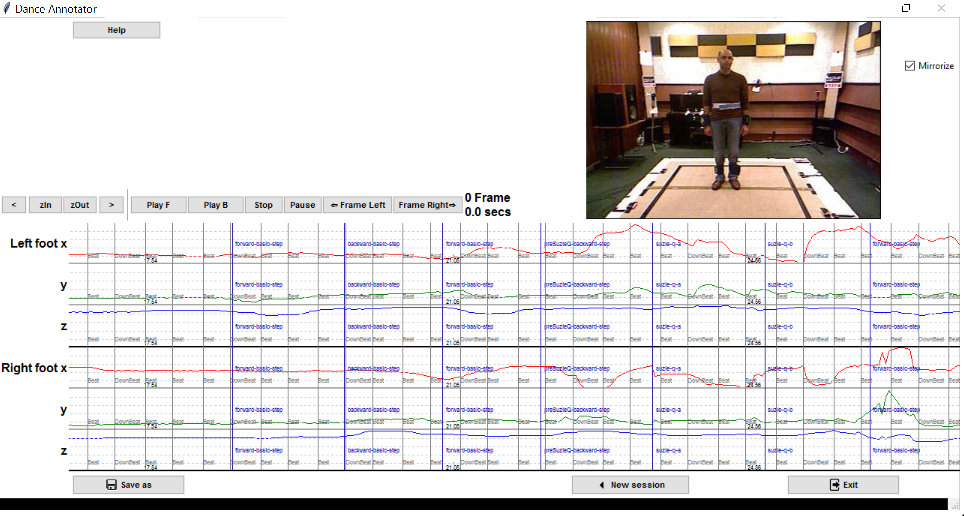

#DanceAnno

A graphic user interface software in Python 3 language using the Tkinter interface that allows to visualize the Kinect signals of the human joints in synchronization with the video frames as shown in the Figure below. In this way the annotator can place exactly annotation lines over the timeline and save the annotation.

## Data and formats

We have written this tool for annotating:
a) a part of the "3DLife" data-set that contains video of Salsa dance performances recorded by a Kinect camera [Essid2013]. The data-set consists of performances that last about 15 seconds each. For demo purposes one performance is included in "Data\Salsa" folder. The full data-set can be requested from [SalsaDataset].
b) the Calus dance data-set of iTreasures project [iTreasures].

## Installation instructions

### Windows 

All the necessary runtime binaries can be found in https://www.python.org/downloads/release/python-340/ and http://www.lfd.uci.edu/~gohlke/pythonlibs/

1. Install Python 3.4 
	- python-3.4.3.amd64.msi
	- Add python.exe to the path of enviroment variables of Windows
2. Install numpy, the numerical package for python, 1.9.2 
	- pip3 install numpy-1.9.2+mkl-cp34-none-win_amd64.whl
3. Install PIL (python imaging library):
	- pip3 install Pillow-3.0.0-cp34-none-win_amd64.whl
4. Start Annotating : Double click on "Start.bat" or create a short-cut on your desktop with the command "pythonw.exe c:\mypath ... \DanceAnno_Application.py"
  
### Linux

1. It should work with python 3.4 or later (e.g. Ubuntu > 14)
2. Install PIL and numpy library

Tests with Ubuntu pending
	
## Use instructions

Loading: You can either use the demo data or load your own data

### Load demo data

- Demo data can be loaded by setting in *DanceAnno_Loader.py* the variable:

*self.debug_FLAG = False*   

to *True*

- Also you can select among two demo datasets:

*self.db = 'salsa' # salsa or calus*
	
### Load your own data: 
#### Loading: You must press 3 buttons to load the content.
1. Press button next to "Skeleton Data (.mat or .skel)" to load a skeleton data. The path is chosen automatically, e.g. load "bertrand_c3_t1_kinect_1.mat"    
2. Press button "Folder with frame data" to load the video frames. For example "Videos\bertrand_c3_t1_kinect_1"
3. (Optional) Press button next to "Load choreography (svl)" to load the choreography data that you should modify with the GUI. For example "c3_male-choreography.svl". There are no female choreographies.
4. (Optional) Press button "Load music beats" to load a txt file with the annotation of music beats.
			
### Annotating: 

Mouse buttons

- "Left hold": Drag annotation line or playline
- "Right": Create annotation for level A or rename an existing annotation for any level
- "Wheel": Zoom plots

Keyboard buttons

- "b": Create annotation for level B
- "d": delete annotation for any level
- "up arrow": play forward / pause
- "down arrow": play backward / pause
- "left arrow": 1 frame left
- "right arrow": 1 frame right
- "v": toggle music beats annotation on/off			
			
### Saving: 

Press "Save as" to save the annotation in an svl or txt file. txt can save two levels of annotation whereas svl only one.
Txt is recommended for its simplicity.

## Video tutorial: 

ToDo: Make a youtube video

## Copyright 

Copyright (C) 2015 - 2016 Center for Research and Technology Hellas. All rights reserved.
Apache 2.0 license; see LICENSE.txt
Dimitrios Ververidis for Information Technologies Institute - Mklab

Multimedia, Knowledge and Social Media Analytics Laboratory (http://www.mklab.iti.gr) 
Information Technologies Institute of Center (http://iti.gr) 
Research and Technology Hellas (http://certh.gr) 

## Acknowledgements		

The research leading to these results has received funding from the European Union 7th Framework Programme (FP7/2011-9) under grant agreement 600676 corresponding to project i-Treasures, "Intangible Treasures - Capturing the Intangible Cultural Heritage and Learning the Rare Know-How of Living Human Treasures", http://i-treasures.eu

## Release Notes

- version 0.1, 17/07/2015, First internal release for Salsa DB
- version 0.2, 06/10/2015, Various fixes, + delete labels, + add second level labels, + Calus DB support
- version 0.3, 01/12/2015, 1st Public version in Github

## ToDos:

- List of Todos 			
					
## References

[Essid2013] Slim Essid, Xinyu Lin, Marc Gowing, Georgios Kordelas et al. "A multi-modal dance corpus for research into interaction between humans in virtual environments," J. Multimodal User Interfaces 7.1-2 (2013): 157-170.

[SalsaDataset] 3DLife/Huawei ACM MM Grand Challenge 2011, http://perso.telecom-paristech.fr/~essid/3dlife-gc-11/#dataset	
		
[iTreasures] EU FP7 project i-Treasures, http://i-treasures.eu 		

This program was written using PyCharm from Intellij. 